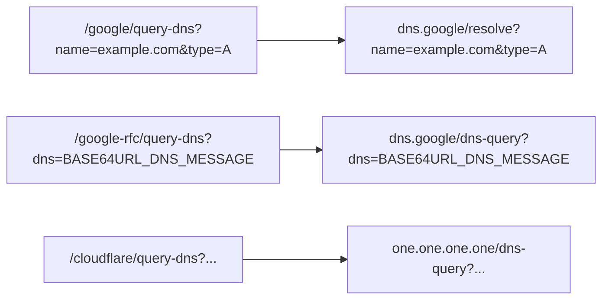

# Google DoH 路由说明

## 背景

Google 提供两个不同语义的接口：

- `/resolve`：Google JSON API，接收 `name`、`type` 等查询参数
- `/dns-query`：RFC 8484 标准 DoH 端点，接收 `dns` 参数或二进制 DNS 消息

此前仓库将 `/google/query-dns` 直接映射到 `/dns-query`，但 README 与首页示例使用的是 `name/type` 查询参数，两者语义不一致。

## 当前设计

## 设计约束

- 不根据 Header 或查询参数做隐式分流
- 不为客户端自动兜底改写请求
- 路径语义必须稳定且可文档化
- 路径前缀冲突时按最长前缀优先匹配，避免 `/google` 截获 `/google-rfc`

## 结果

- `/google/query-dns` 明确服务于 JSON API 客户端
- `/google-rfc/query-dns` 明确服务于 RFC 8484 客户端
- 文档和默认配置保持一致
