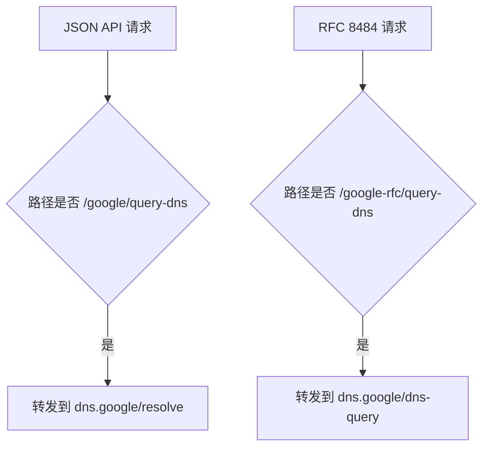

# Google DoH 路由验收用例

## 目标

确认 Google JSON API 与 RFC 8484 DoH 请求被路由到正确端点。

## 用例



### 用例 1：Google JSON API 请求

- 前置条件：Worker 使用默认配置
- 请求：

```text
GET /google/query-dns?name=example.com&type=A
Accept: application/dns-json
```

- 期望结果：

```text
转发目标为 https://dns.google/resolve?name=example.com&type=A
```

### 用例 2：Google RFC 8484 请求

- 前置条件：Worker 使用默认配置
- 请求：

```text
GET /google-rfc/query-dns?dns=AAABAAABAAAAAAAAB2V4YW1wbGUDY29tAAABAAE
Accept: application/dns-message
```

- 期望结果：

```text
转发目标为 https://dns.google/dns-query?dns=AAABAAABAAAAAAAAB2V4YW1wbGUDY29tAAABAAE
```
